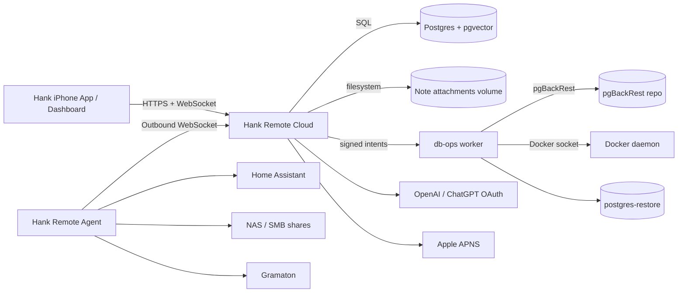
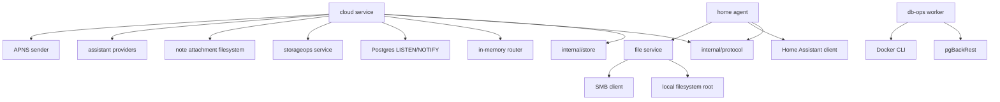
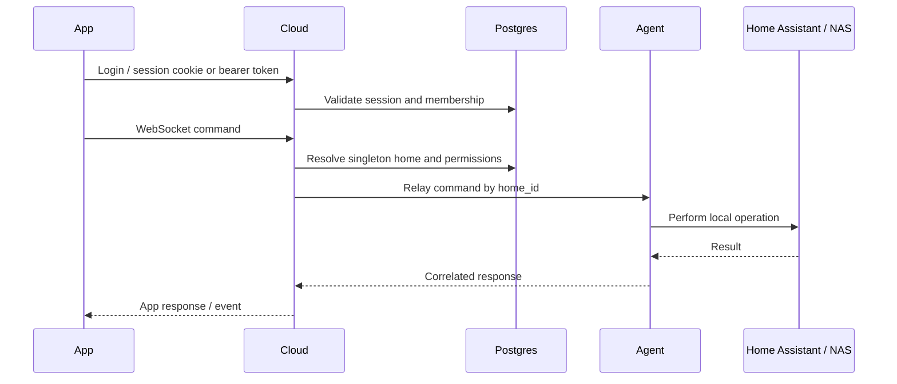
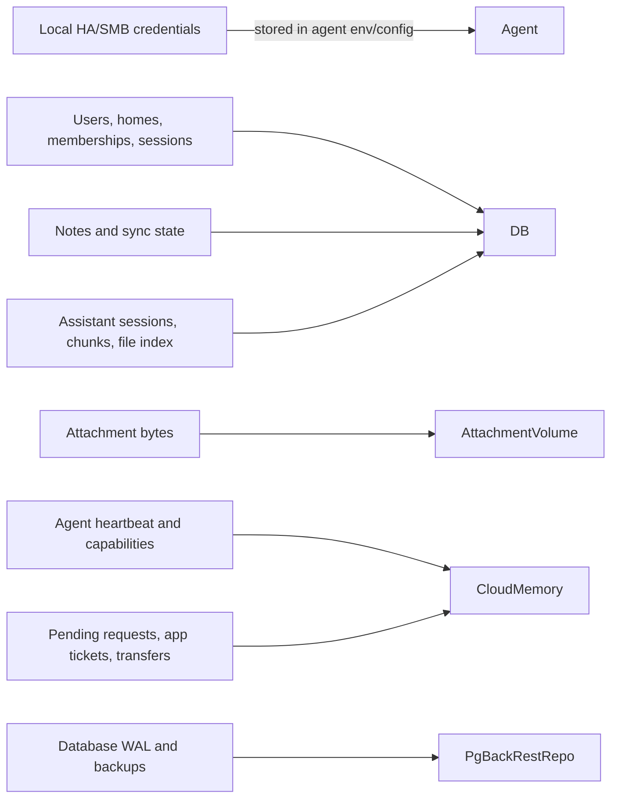

# Hank Backend Architecture and Structural Integrity Audit

Date: 2026-05-30

## Scope and Evidence

This audit reviewed the current `HankServerside` repository, with emphasis on the cloud service, home agent, protocol, persistence layer, Docker topology, storage operations, route handlers, authentication, authorization, file handling, observability, backup, and restore workflows.

Evidence reviewed:

- `README.md`
- `docs/architecture.md`
- `docker-compose.yml`
- `Dockerfile.server`
- `Dockerfile.postgres`
- `Dockerfile.dbops`
- `cmd/hank-remote-cloud`
- `cmd/hank-remote-agent`
- `internal/cloud`
- `internal/agent`
- `internal/protocol`
- `internal/store`
- `internal/storageops`
- `internal/config`
- `docs/runbooks`

Limitations:

- No production database, query logs, `pg_stat_statements`, load-test results, restore logs, or live monitoring system were available.
- The "top 20 slowest queries" section is therefore a static risk analysis of likely expensive paths, not observed production latency.
- Local runtime env files were found in the repo root but not read, to avoid exposing secrets.
- The working tree already had uncommitted changes in several Go and JavaScript files before this audit. Findings that touch those files reflect the current checkout, not an assertion about when the changes were introduced.

## Executive Summary

Hank has a coherent early architecture for a single-home, single-cloud-instance deployment. The core product direction is sound: the iPhone app talks only to Hank Cloud, the home agent keeps an outbound WebSocket to the cloud, and local Home Assistant/NAS credentials remain inside the home network.

The backend is not yet production-ready for broad multi-user or horizontally scaled workloads. The largest structural risks are not a single obvious remote-code-execution bug, but a set of production blockers:

- Cloud routing, WebSocket tickets, file-transfer tokens, pending requests, rate limits, and login backoff are all in-memory.
- The data model is still guarded by a singleton-home startup check and `/v1/home` singleton APIs.
- Schema migration is implemented as startup `CREATE/ALTER IF NOT EXISTS` statements with no version table, rollback plan, or drift detection.
- Several database business rules are enforced only in application code.
- The db-ops container has powerful host-level control through the Docker socket.
- Backup/restore workflows are documented and partially automated, but no restore evidence was available for this audit.
- Query and capacity behavior cannot be certified because there is no observed slow-query telemetry or load-test evidence.

Production readiness score: **58 / 100**.

Verdict: **Suitable for controlled single-home beta use with careful operator access. Not ready for production growth without architectural hardening.**

## Phase 1: Architecture Review

### Service Inventory

| Component | Location | Responsibility | Production concern |
| --- | --- | --- | --- |
| Cloud service | `cmd/hank-remote-cloud`, `internal/cloud` | Public HTTPS/WebSocket entrypoint, dashboard, auth, home routing, relay, assistant, storage control | In-memory router and state block horizontal scaling |
| Home agent | `cmd/hank-remote-agent`, `internal/agent` | Outbound WebSocket client, local Home Assistant/NAS/file/notes/media operations | Agent local permissions are broad per configured source |
| Postgres | `postgres` Compose service | Durable app data, sessions, homes, notes, assistant state, tokens | Startup migrations, weak schema constraints, no drift detection |
| pgvector | `Dockerfile.postgres`, `internal/store` | Optional vector columns for assistant search | Vector dimension fixed at `VECTOR(768)` while app config is variable |
| pgBackRest | `postgres`, `db-ops` services | WAL archiving and backups | Needs verified restore cadence and locked-down operator surface |
| db-ops worker | `cmd/hank-db-ops`, `internal/storageops`, `Dockerfile.dbops` | Backup, checksum, restore test, primary restore orchestration | Docker socket mount gives host-level control |
| Dashboard static UI | `internal/cloud/ui` | Admin and user-facing browser UI | Uses same cloud process and session model |
| Protocol package | `internal/protocol` | Versioned JSON envelopes and command bodies | Good separation, but request/response state is in-memory |

### Docker Containers

| Container | Network exposure | Volumes | Notes |
| --- | --- | --- | --- |
| `cloud` | Host bind to port 8080 through env | db-ops state/logs, note attachments | Public-facing service |
| `postgres` | Internal DB network | Postgres data, pgBackRest repo/logs | Custom Postgres 17 image with pgvector |
| `db-ops` | Internal DB and restore networks | Docker socket, workspace read-only, backup repo/logs/state | Highest operational privilege |
| `postgres-restore` | Restore profile only | restore data, backup repo read-only | Used for restore tests |
| `agent` | Profile-gated, outbound only | agent files, notes | Correctly avoids inbound home-network exposure |

No queue service is present. No external object storage service is present. Note attachments are stored on the cloud filesystem.

### External Integrations

| Integration | Direction | Use |
| --- | --- | --- |
| Home Assistant | Agent to local HA | Fetch states and call services |
| SMB/NAS | Agent to local network share | File list/search/download/upload/move/delete |
| OpenAI API / OAuth | Cloud to external provider | Assistant chat, embeddings, account link |
| Ollama | Cloud to configured base URL | Local assistant provider option |
| APNS | Cloud to Apple | Push notifications |
| Gramaton | Agent to external media provider | Media planning/download operations |
| Docker daemon | db-ops to host Docker socket | Restore orchestration |

### Architecture Diagram



### Service Dependency Map



### Request Flow Diagram



### Data Flow Diagram



### Responsibility Separation

Strengths:

- Cloud and agent responsibilities are mostly separated.
- The agent owns home-local credentials and network access.
- The app-facing API is intentionally higher-level than raw SMB.
- Shared messages live in `internal/protocol`.
- Store access is mostly centralized under `internal/store`.

Concerns:

- The cloud service combines public API, dashboard UI, relay routing, assistant orchestration, storage operations, and realtime fanout in one process.
- The singleton home model is embedded in routes and startup validation.
- Business rules are split between handlers, store methods, and in-memory router behavior.
- Operational storage actions are reachable through the same public cloud process, protected by admin auth and signed intents but still coupled to the app server.

### Hidden Dependencies

- Horizontal scaling is blocked by in-memory router state.
- WebSocket app tickets and file transfer tokens are process-local.
- Rate limiting and login backoff are process-local and restart-reset.
- Realtime event authorization depends heavily on singleton-home assumptions and client-selected topics.
- Backup/restore orchestration depends on Docker socket access from the db-ops container.
- Assistant vector search depends on pgvector availability and a hard-coded vector dimension.

## Phase 2: Database Audit

### Schema Overview

The schema is created at process startup in `internal/store/store.go`. Tables include:

| Area | Tables |
| --- | --- |
| Identity and homes | `users`, `homes`, `home_memberships`, `home_invitations` |
| Agents and sessions | `agents`, `agent_tokens`, `app_sessions` |
| Notifications | `notification_settings`, `apns_devices` |
| Notes | `home_notes`, `user_notes`, `note_shares`, `note_operations`, `note_attachments` |
| Profile data | `user_profile_settings`, `user_profile_secret_vaults`, `user_profile_backups` |
| Home config | `home_note_sync_state`, `home_service_profiles`, `home_permissions`, `home_member_permissions` |
| Assistant | `assistant_sessions`, `assistant_messages`, `assistant_runs`, `assistant_attachments`, `assistant_tool_calls`, `assistant_settings`, `assistant_documents`, `assistant_chunks`, `assistant_file_index`, `assistant_calendar_entries` |
| OpenAI OAuth | `openai_accounts`, `openai_oauth_states` |

### Schema Strengths

- Primary keys exist on all reviewed tables.
- Session and agent tokens are stored as hashes, not raw tokens.
- Many core foreign keys exist.
- Important uniqueness rules exist for email, token hashes, memberships, note IDs, assistant chunks, assistant settings, OpenAI accounts, and calendar external IDs.
- Soft-delete columns exist for notes and note attachments.
- pgvector is optional, so the service can run without the extension.

### High-Risk Schema Issues

1. **No versioned migration framework**

   Startup migrations use idempotent SQL statements without a schema version table, rollback scripts, or drift detection. This is workable for early development but unsafe for production upgrades.

2. **Singleton-home guard is a structural product limit**

   `validateSingletonHome` rejects more than one home at startup. This makes the current deployment intentionally single-home and prevents future multi-tenant production growth without redesigning routes and validation.

3. **Database does not enforce many business rules**

   Enum-like values such as membership role, agent status, invitation role, service type, note page type, assistant run state, attachment status, and provider types lack database `CHECK` constraints.

4. **Foreign key coverage is incomplete**

   Examples:

   - `note_operations.session_id` is not constrained to `app_sessions`.
   - `home_note_sync_state.agent_id` is not constrained to `agents`.
   - Several FKs omit explicit delete behavior, leaving lifecycle semantics to app code.

5. **Assistant file index uniqueness is too broad**

   `assistant_file_index` has `UNIQUE(home_id, path)` while also storing `service_profile_id`. Identical paths from different file sources can collide. Prefer `UNIQUE(home_id, service_profile_id, path)` after a cleanup migration.

6. **Vector dimension is hard-coded in schema**

   pgvector columns are created as `VECTOR(768)`, while `HANK_REMOTE_AI_EMBEDDING_DIMENSION` is configurable. Non-768 embeddings can fail or force fallback behavior when vector columns are active.

### Duplicate and Denormalized Data

| Issue | Risk | Recommendation |
| --- | --- | --- |
| `home_notes` and `user_notes` both exist | Legacy duplicate storage and migration complexity | Freeze `home_notes`, migrate fully to `user_notes`, then remove or archive in a versioned migration |
| `user_notes.content` and `user_notes.body_markdown` both store body-like data | Divergence risk | Define one canonical body column and migrate readers/writers |
| `assistant_documents`, `assistant_chunks`, and `assistant_file_index` duplicate searchable content from notes/files/conversations | Expected for search, but retention is unclear | Add lifecycle jobs and source invalidation rules |
| `assistant_file_index.embedding_json` and `embedding` duplicate vector data | Operationally useful fallback, but doubles storage | Keep only if pgvector optionality is intentional, document retention |

### Index Review

Existing indexes cover several common paths:

- Homes by user
- Memberships by user
- Invitations by email
- Agents by home
- Agent tokens by agent
- Sessions by user
- APNS devices by token/session
- Notes by owner/home updated timestamp
- Note shares by home/target user
- Note operations by note/version
- Assistant sessions/messages/attachments/tool calls
- Assistant documents by home/source type
- Assistant file index by home/updated timestamp

Recommended additions:

```sql
CREATE INDEX idx_agent_tokens_home_created
  ON agent_tokens(home_id, created_at DESC);

CREATE UNIQUE INDEX idx_agents_home_id_unique
  ON agents(home_id);

CREATE INDEX idx_home_invitations_home_pending_created
  ON home_invitations(home_id, accepted_at, created_at DESC);

CREATE INDEX idx_assistant_file_index_home_directory_updated
  ON assistant_file_index(home_id, is_directory, updated_at DESC);

CREATE INDEX idx_assistant_sessions_home_user_updated
  ON assistant_sessions(home_id, user_id, updated_at DESC);
```

Before adding `idx_agents_home_id_unique`, decide whether the product supports one active agent per home or multiple agents per home. The code currently routes one agent connection per home.

Recommended pgvector indexes once data size grows:

```sql
CREATE INDEX idx_assistant_chunks_embedding_hnsw
  ON assistant_chunks USING hnsw (embedding vector_cosine_ops)
  WHERE embedding IS NOT NULL;

CREATE INDEX idx_assistant_file_index_embedding_hnsw
  ON assistant_file_index USING hnsw (embedding vector_cosine_ops)
  WHERE embedding IS NOT NULL;
```

Recommended search indexes:

```sql
CREATE INDEX idx_assistant_documents_search_text_tsv
  ON assistant_documents USING gin (to_tsvector('simple', search_text));

CREATE INDEX idx_assistant_file_index_search_text_tsv
  ON assistant_file_index USING gin (to_tsvector('simple', search_text));
```

### Query Review

Observed telemetry was not available, so true slow-query ranking cannot be produced. Enable `pg_stat_statements` and collect at least 7 days of representative traffic before accepting production readiness.

Static top slow-query candidates:

| Rank | Path | Reason | Recommendation |
| --- | --- | --- | --- |
| 1 | `SearchAssistantContext` | Loads broad document/chunk/file candidates and scores in Go | Add FTS/vector indexes and source filters |
| 2 | `searchAssistantVectorContext` | `ORDER BY embedding <=> vector` without pgvector ANN indexes | Add HNSW or IVFFLAT indexes |
| 3 | `SearchAssistantFileDirectories` | Pulls up to 500 directory rows and scores in Go | Add `(home_id, is_directory, updated_at)` and FTS |
| 4 | `ListVisibleHomeNotes` | Share join plus deleted filtering and ordering | Validate plans with realistic share counts |
| 5 | `ListSyncedHomeNotes` | Can return all home notes including deleted | Page or delta-sync by timestamp/version |
| 6 | `ListProfileNotes` | Can return all profile notes | Page by updated timestamp |
| 7 | `AssistantIndexStats` | Aggregate counts over assistant index tables | Cache or maintain counters for large data |
| 8 | `ListAgentTokensByHome` | No home/created composite index | Add `idx_agent_tokens_home_created` |
| 9 | `ListPendingHomeInvitations` | No home/pending/created composite index | Add composite index |
| 10 | `GetLatestHomeNoteUpdate` | Note/share visibility logic can expand | Validate plan and add covering index if needed |
| 11 | File `files.search` agent workflow | Walks local/SMB trees up to bounded directory count | Add source-side index/cache for large NAS |
| 12 | Assistant conversation indexing | Can re-index growing conversations | Add incremental invalidation and limits |
| 13 | File index sync | Stores and searches all file entries | Add paging, source partitioning, and retention |
| 14 | OpenAI OAuth state lookup | Expired rows are consumed but not globally pruned | Add cleanup job |
| 15 | App session lookup by token hash | Indexed through uniqueness, okay today | Add expired/revoked cleanup |
| 16 | APNS active-device query | Joins devices to sessions | Validate under many devices |
| 17 | Storage event listing | File-backed event logs read and prune | Move to bounded table or rotate logs if multi-node |
| 18 | Realtime notification fanout | Iterates process-local app map | Needs broker for multi-node |
| 19 | File transfers | Long-lived in-memory registry | Needs durable/affine transfer routing |
| 20 | `GetAgentByHomeID` | Multiple agents possible but one selected | Add unique constraint or multi-agent routing |

### Migration Review

Current state:

- No `migrations/` directory.
- No schema version table.
- No down migrations.
- No drift detection.
- Migration statements are not grouped as a single declared release.
- Startup uses `CREATE TABLE IF NOT EXISTS`, `ALTER TABLE ADD COLUMN IF NOT EXISTS`, and data updates.

Production risk:

- A failed partial migration can leave an ambiguous schema.
- Rollback is manual.
- Manual production changes are hard to detect.
- Data migrations cannot be audited by release.

Recommendation:

Adopt a migration tool or a small internal migration runner with:

- Monotonic migration versions
- Checksums
- Transactional migrations where Postgres allows them
- Explicit no-transaction migrations for indexes created concurrently
- Drift check in CI and startup
- Backup-before-upgrade workflow
- Rollback or forward-fix plan per release

### Data Lifecycle Review

| Data class | Current behavior | Gap |
| --- | --- | --- |
| Sessions | Expiration and revocation supported | No pruning job found |
| Agent tokens | Revocation and expiration supported | No global cleanup job found |
| Invitations | Expiration and delete supported | No pruning job found |
| OAuth states | Consumed/deleted on callback | Expired state cleanup should be scheduled |
| Notes | Soft deletes via `deleted_at` | Retention/restore policy unclear |
| Attachments | Soft delete metadata, bytes stored on disk | Physical cleanup and recovery policy unclear |
| Assistant traces | In-memory bounded trace log | Not durable for incident review |
| Assistant index | Derived data persisted | Retention and invalidation need stronger rules |
| Storage events | File-backed logs | Rotation and central retention need definition |

## Phase 3: API Architecture Review

### Endpoint Groups

| Group | Routes |
| --- | --- |
| UI | `/`, `/dashboard`, dashboard subpages, `/assets/`, `/docs/deployment` |
| Health/ops | `/healthz`, `/readyz`, `/metrics` |
| Auth | `/v1/auth/register`, `/v1/auth/login`, `/v1/auth/logout` |
| User profile | `/v1/me`, `/v1/me/notes`, `/v1/me/profile`, `/v1/me/profile-secret-vault`, `/v1/me/profile-backup` |
| Notifications | `/v1/me/devices/apns`, `/v1/me/notification-settings` |
| OAuth | `/v1/oauth/openai/status`, `/v1/oauth/openai/start`, `/v1/oauth/openai/callback` |
| Home | `/v1/home`, `/v1/home/...`, `/v1/home/invitations/accept` |
| File transfers | `/v1/home/files/downloads`, `/v1/home/files/uploads`, `/v1/file-transfers/{id}` |
| WebSocket | `/ws/agent`, `/ws/app`, `/v1/ws/app-ticket` |

### API Strengths

- HTTP auth is centralized through `requireAuth`.
- Cookie-authenticated unsafe methods require CSRF tokens.
- Home feature authorization exists for files, notes, and Home Assistant.
- Admin-only checks protect token management, storage operations, and member management paths.
- Request bodies are size-limited.
- WebSocket messages are size-limited.
- Agent tokens are hashed in storage.

### API Concerns

1. **Singleton routes will not scale to multi-home accounts**

   `/v1/home` and `/v1/home/...` assume a single home. A production SaaS model needs `/v1/homes/{home_id}/...` and explicit membership checks per home.

2. **Controller/service separation is uneven**

   Some handlers are thin, but assistant, file transfer, storage, and notes paths combine parsing, authorization, orchestration, and response shaping in large cloud package files.

3. **File transfer token is returned in URL query string**

   `/v1/file-transfers/{id}?token=...` is short-lived, but query tokens are routinely leaked to logs, browser history, and referrers. Prefer one-time bearer headers or POST handoff.

4. **Agent WebSocket accepts credentials via query fallback**

   Header auth is preferred, but query fallback remains for compatibility. This should have a removal date because query credentials leak more easily.

5. **App WebSocket connection identity is session keyed**

   The router stores one app connection per session ID. Multiple tabs/devices with the same session can replace each other or cause pending request cleanup to affect the wrong connection.

### Rate Limiting

Implemented:

- Registration rate limiting.
- Login rate limiting and per-email backoff.
- Agent WebSocket rate limiting.
- Pending routed request cap per app connection.

Gaps:

- Limits are in-memory and reset on restart.
- Limits are not shared across cloud instances.
- The limiter map is unbounded under high-cardinality attack.
- Search, assistant, file transfer, media, and storage endpoints need explicit per-user/per-home budgets.
- No distributed abuse protection layer is present.

## Phase 4: Authentication and Authorization Audit

### Authentication

Implemented controls:

- Passwords are hashed with bcrypt.
- Session tokens are hashed in the database.
- Session expiration and revocation are supported.
- OpenAI OAuth state uses hashed one-time state records with expiration.
- App WebSocket tickets are one-time and short-lived.
- Session cookies are `HttpOnly` and `SameSite=Strict`.
- CSRF cookie/header pattern is implemented for browser writes.

Risks:

- App WebSocket tickets are process-local.
- Login backoff is process-local.
- `requestIsHTTPS` trusts `X-Forwarded-Proto` without a trusted-proxy boundary.
- Secret encryption is optional. If `HANK_REMOTE_SECRET_ENCRYPTION_KEY` is absent, OAuth/access secrets can persist plaintext by design.
- Existing local `.env.cloud` and `.env.agent` files are mode `0644`; they should be `0600`.

### Authorization

Implemented controls:

- Home membership is checked before home API access.
- Admin role is required for sensitive home management and storage operations.
- Feature permissions exist for files, notes, and Home Assistant.
- Agent token records are bound to a home and agent.
- Cloud routes agent commands by home ID, not by direct app-supplied local network credentials.

Risks:

- Singleton-home logic masks multi-tenant authorization issues that will appear once multiple homes exist.
- Realtime subscriptions are topic strings selected by clients, not server-scoped subscriptions. In the current singleton model this is limited, but profile and note event metadata can be over-broadcast between authenticated app connections.
- Agent capabilities are advertised but do not appear to enforce least privilege at the protocol level; endpoint permission checks happen before routing, but agent-side tool permissions are broad once a command reaches the agent.

## Phase 5: Security Assessment

### Secrets Management

Strengths:

- Env files are gitignored.
- Token hashes are stored instead of raw app/agent tokens.
- OpenAI tokens can be encrypted at rest using AES-GCM derived from `HANK_REMOTE_SECRET_ENCRYPTION_KEY`.
- db-ops intent secret and pgBackRest cipher pass are required by config.
- Storage operation output has redaction helpers.

Risks:

- Local `.env.cloud` and `.env.agent` are world-readable by default permissions in this checkout (`0644`).
- Secret-at-rest encryption is optional.
- Agent config persistence can write SMB passwords into `.env.agent`.
- db-ops has access to operational secrets and the Docker socket.
- Secret rotation is partially documented, but no automated rotation workflow was verified.

### File System Security

Strengths:

- Cloud note attachment paths are rooted, use safe filenames, and resolve symlinks.
- Agent local file paths are cleaned, rooted, and checked for symlink escape.
- SMB paths are cleaned to share-relative paths.

Risks:

- Cross-source `files.move` is implemented as recursive copy plus delete. There is no checksum verification, rollback, resume, idempotency key, or partial-copy cleanup guarantee.
- Long file operations can occupy routed request slots for extended periods.
- File-transfer tokens are process-local and URL-based.
- Note attachment byte cleanup after soft delete needs an explicit lifecycle job.

### Input Validation

Strengths:

- JSON body size is capped.
- WebSocket message size is capped.
- Several path and name inputs are trimmed and validated.
- Agent file paths are normalized.
- SQL access uses parameterized queries.

Risks:

- `rebindPlaceholders` rewrites every `?` rune without SQL-string awareness. Current queries appear safe, but this is fragile if future SQL contains literal question marks.
- Assistant prompts, search inputs, and provider responses need explicit cost and output-size budgets, not just auth.
- Storage operations should treat all operator-provided paths as sensitive and continue to avoid shell interpolation.

### CSRF and Session Security

Implemented:

- `SameSite=Strict` session and CSRF cookies.
- CSRF header validation for unsafe cookie-authenticated HTTP methods.
- Bearer-token API requests do not require CSRF.
- Same-origin checks are applied to WebSocket requests when an `Origin` header is present.

Risks:

- WebSocket accepts `OriginPatterns: ["*"]` after the custom optional-origin check. If a client omits `Origin`, the request proceeds.
- Secure cookie detection depends on trusted reverse-proxy headers.

## Phase 6: Agent Architecture Review

### Agent Isolation

Strengths:

- Agent connects outbound only.
- Cloud does not require raw SMB credentials from the phone app.
- Local credentials stay in the home environment.
- File roots and SMB share roots are bounded.

Risks:

- Once an app request is authorized and routed, the agent executes with the full permissions of its configured local credentials.
- No per-source ACL model exists beyond cloud-side feature permission and service profile configuration.
- Agent commands are command-name based. There is no separate capability token or policy envelope per tool invocation.
- Long-running or destructive operations need stronger audit and recovery behavior.

### Tool Execution Security

| Tool area | Assessment |
| --- | --- |
| Home Assistant | Safer than raw local network exposure, but service-call commands can be powerful and need detailed audit logs |
| Files | Path traversal protections are good; destructive and cross-source operations need transaction-like safety |
| SMB | Share credentials are broad; no fine-grained per-path policy enforced by Hank |
| Media downloads | External API and file writes need rate, confirmation, and audit controls |
| Shell execution | No general-purpose shell tool was identified in the agent command dispatcher |

## Phase 7: Observability and Operations

### Logging

Strengths:

- Structured logging is used.
- Request IDs are added.
- Connection lifecycle and route failures have log/metric hooks.
- Storage operations emit redacted events.

Gaps:

- No durable audit log table for security-sensitive actions such as login failures, token creation/revocation, permission changes, storage restore requests, and destructive file operations.
- Assistant traces are in-memory and not suitable for incident investigation after restart.
- Redaction needs to be enforced consistently across all future logs, especially file paths and third-party API payloads.

### Metrics

Implemented:

- Online agents/apps gauges.
- Auth failure counters.
- Command counters and failure counters.
- Command latency sum/count.
- Route failure counters.
- `/metrics` requires authenticated admin access.

Gaps:

- Metrics are in-memory and reset on restart.
- No histograms for latency distribution.
- No DB pool metrics.
- No Go runtime metrics were identified.
- No per-route HTTP metrics were identified.
- Existing runbook text still includes unauthenticated curl examples for `/metrics`.

### Alerting

No alerting configuration was found. Required production alerts:

- Failed login spikes.
- Agent authentication failures.
- Agent offline duration.
- WebSocket disconnect rate.
- Routed request timeouts.
- Database connection failures.
- Backup failure or stale backup.
- Restore-test failure.
- Disk usage for Postgres, pgBackRest, note attachments, and db-ops logs.
- Assistant provider error rate and cost/call volume.

## Phase 8: Backup and Recovery

### Current Backup Design

Strengths:

- pgBackRest is included.
- WAL archiving is configured in Postgres.
- db-ops supports backup, checksum, restore-test, and primary restore workflows.
- Restore-test profile/container exists.
- pgBackRest repo cipher pass is required by config.
- Runbooks exist for storage failures and single-host compose operation.

Risks:

- Restore procedures were not verified in this audit.
- db-ops has Docker socket access and should be treated as host-root-equivalent.
- db-ops state/log files use permissive creation modes in several places and rely on umask.
- Cloud note attachments are outside Postgres and need a backup/restore plan aligned with DB point-in-time recovery.
- Env/config backups and secret recovery are not proven.

### Required Recovery Procedure

Minimum production recovery runbook:

1. Record current deployment version, image digests, env file checksums, Postgres volume name, and pgBackRest repo location.
2. Verify latest successful backup label and WAL archive freshness.
3. Start isolated restore target using the restore profile.
4. Restore from selected backup into `postgres-restore`.
5. Run schema integrity checks.
6. Run application smoke tests against restored DB.
7. Verify representative notes, users, homes, sessions, agent tokens, assistant index records, and storage operation events.
8. Restore note attachment volume to a matching point and verify attachment checksums.
9. Document observed RTO and RPO.
10. Only then execute primary restore workflow.

### Restore Test Report

Status: **Not available**.

This is a production readiness blocker. A restore system is not production-ready until a restore has been executed, timed, and checked against application-level integrity assertions.

### Recovery Time Estimate

Without a restore test, only a rough estimate is possible:

| Dataset size | Expected RTO range | Notes |
| --- | --- | --- |
| Small single-home beta | 15 to 60 minutes | Mostly operator time |
| Moderate home with notes/files index | 1 to 3 hours | Depends on WAL replay and attachment restore |
| Larger production dataset | Unknown | Requires real backup size and restore benchmark |

## Phase 9: Performance and Scalability

### Load Testing Status

No load-test artifacts were found. The following must be measured before production:

- Concurrent login and session validation.
- Concurrent app WebSockets.
- Concurrent agents.
- Routed command latency under agent disconnect/reconnect.
- File transfer throughput and memory use.
- Assistant indexing/search latency with large notes and file indexes.
- SMB search behavior against large NAS trees.
- Backup impact on normal traffic.

### Bottleneck Analysis

| Bottleneck | Current limit | Scaling recommendation |
| --- | --- | --- |
| Cloud router | Process memory only | Move connection registry/pending request coordination to a broker or enforce sticky routing with durable request records |
| App tickets | Process memory only | Store ticket hashes in Postgres or Redis |
| File transfers | Process memory only | Store transfer leases in Postgres/Redis and use object storage or sticky routing |
| Rate limits | Process memory only | Use Redis or edge limiter |
| Login backoff | Process memory only | Persist by normalized email and IP |
| Realtime fanout | Process memory only | Use Postgres LISTEN plus node-local auth filtering, or a broker |
| Database migrations | Startup SQL only | Versioned migrations with CI drift checks |
| Assistant search | Broad SQL fetch and Go scoring | FTS/vector indexes, pagination, background indexing |
| Storage ops | Single privileged worker | Isolate worker, narrow Docker access, add queue/lease model |
| Singleton home | One home enforced at startup | Introduce explicit home IDs in API and remove singleton validation |

### Capacity Planning Estimates

The current architecture can likely support:

- One home.
- One active agent per home.
- A small number of concurrent app/dashboard sessions.
- Moderate notes and file indexes.
- Controlled file operations.

It cannot be certified for:

- Multiple homes.
- Multiple cloud replicas.
- High concurrent WebSocket counts.
- Large NAS-wide search/indexing workloads.
- High-volume assistant workloads.
- Strict RTO/RPO commitments.

## Phase 10: Technical Debt Assessment

### Scorecard by Area

| Area | Score | Rating | Reason |
| --- | ---: | --- | --- |
| Architecture | 6/10 | Medium risk | Good cloud-agent direction, but singleton and in-memory routing limit growth |
| Database design | 5/10 | High risk | Good base tables, but migrations/constraints/lifecycle need hardening |
| Security | 6/10 | Medium-high risk | Several strong controls, but secrets, token transport, db-ops privilege, and realtime scoping need work |
| Scalability | 4/10 | High risk | Horizontal scaling is blocked by process-local state |
| Maintainability | 6/10 | Medium risk | Packages are clear, but cloud handlers are growing large |
| Operational readiness | 5/10 | High risk | Backups exist, but restore/alerting/load evidence is missing |

### Critical Findings

No confirmed critical remotely exploitable vulnerability was identified from static review.

This does not mean production is safe. Several high findings must be resolved before production.

### High-Priority Findings

| ID | Finding | Risk | Effort | Recommended order |
| --- | --- | --- | --- | --- |
| H1 | No versioned migration, rollback, or drift detection system | Unsafe production upgrades | Medium | 1 |
| H2 | In-memory router/tickets/transfers/rate limits prevent horizontal scaling and weaken restart behavior | Availability and scale blocker | Large | 2 |
| H3 | Singleton-home API and startup validation | Product scalability blocker | Large | 3 |
| H4 | db-ops Docker socket and root-like operational privilege | Host compromise blast radius | Medium | 4 |
| H5 | Weak DB business-rule constraints and incomplete FK semantics | Data integrity drift | Medium | 5 |
| H6 | Cross-source file move copy/delete lacks verification, rollback, resume, and tests | Data loss risk | Medium | 6 |
| H7 | Restore procedures were not verified | Recovery promises unproven | Medium | 7 |

### Medium-Priority Findings

| ID | Finding | Risk | Effort |
| --- | --- | --- | --- |
| M1 | Agent WebSocket query-parameter auth fallback | Credential leakage risk | Small |
| M2 | File transfer tokens in URLs | Token leakage risk | Small |
| M3 | Local env files mode `0644` | Secret exposure on shared host | Small |
| M4 | Realtime topics are client-selected without strong server scoping | Metadata leakage under multi-user/multi-home | Medium |
| M5 | One app connection per session ID | Multi-tab/device correctness bug | Medium |
| M6 | Assistant vector dimension mismatch risk | Search/index failures when dimension changes | Small |
| M7 | No observed slow-query telemetry | Performance blind spot | Medium |
| M8 | Metrics lack histograms, DB/runtime metrics, and external persistence | Operational blind spot | Medium |
| M9 | Storageops files created with permissive modes | Operational metadata exposure | Small |
| M10 | Docs drift around `/metrics` access | Operator confusion | Small |
| M11 | Derived assistant/file index retention unclear | Storage growth risk | Medium |

### Low-Priority Findings

| ID | Finding | Risk | Effort |
| --- | --- | --- | --- |
| L1 | HTTP server only sets `ReadHeaderTimeout` | Slow-client/resource risk | Small |
| L2 | SQL placeholder rebinding is string-literal unaware | Future query bug risk | Small |
| L3 | Dashboard and API live in one binary | Deployment flexibility limit | Medium |
| L4 | Some legacy docs remain phase/task oriented rather than operator oriented | Maintainability cost | Small |

## Remediation Roadmap

### Stage 0: Immediate Hardening

1. Set `.env.cloud` and `.env.agent` permissions to `0600` in deployment docs and scripts.
2. Remove or deadline query-parameter agent token fallback.
3. Stop returning file-transfer tokens in URLs; require bearer-style token submission.
4. Add tests for cross-source `files.move`, including partial failure and directory moves.
5. Harden storageops file modes to `0700` directories and `0600` files.
6. Update runbooks so `/metrics` examples use authenticated/admin access.

### Stage 1: Database Production Safety

1. Add versioned migrations with checksums.
2. Create a schema drift check.
3. Add missing `CHECK` constraints for roles, statuses, page types, provider values, and run states.
4. Add or formalize FK delete behavior.
5. Fix `assistant_file_index` uniqueness to include `service_profile_id`.
6. Resolve `home_notes` legacy storage and canonicalize note body storage.
7. Add cleanup jobs for expired sessions, invitations, OAuth states, revoked/expired tokens, and derived indexes.

### Stage 2: Observability and Recovery

1. Enable `pg_stat_statements`.
2. Add HTTP route metrics, DB pool metrics, Go runtime metrics, and latency histograms.
3. Add durable audit logging for security/admin/destructive operations.
4. Configure alerts for auth failures, agent failures, DB failures, stale backups, and disk usage.
5. Run and document a restore test with observed RTO/RPO.
6. Add attachment-volume backup and restore validation.

### Stage 3: Horizontal Scalability

1. Replace singleton APIs with `/v1/homes/{home_id}/...`.
2. Remove `validateSingletonHome`.
3. Redesign router identity to allow multiple agents/apps per home/session.
4. Persist app tickets, transfer leases, and pending request metadata in Postgres or Redis.
5. Add sticky routing or broker-backed relay delivery.
6. Move rate limits and login backoff to a shared store.
7. Server-scope realtime subscriptions by authenticated user/home membership.

### Stage 4: Performance

1. Add FTS indexes for assistant document and file search.
2. Add pgvector ANN indexes where pgvector is enabled.
3. Add pagination/delta APIs for notes, file indexes, and assistant context.
4. Add a background indexing queue or lease system.
5. Load test WebSockets, routed commands, file transfers, assistant search, and backup impact.

## Production Readiness Scorecard

| Success criterion | Status | Notes |
| --- | --- | --- |
| No critical security findings | Pass with caveat | No confirmed critical static issue, but high operational risks remain |
| No unbounded data access paths | Partial | File roots are bounded, but realtime topics and broad agent credentials need tightening |
| No high-risk database design issues | Fail | Migration, constraints, singleton, and index uniqueness issues remain |
| Restore procedures verified | Fail | No restore evidence available |
| Monitoring and alerting operational | Fail | Metrics exist, alerting not configured or verified |
| Clear path to horizontal growth | Partial | Direction is clear, but process-local state and singleton API require major work |

## Final Recommendation

Do not treat the current backend as production-ready for broad external users. It is a solid controlled-beta foundation if deployed as a single-home, single-cloud-instance system with restricted admin access, hardened env permissions, verified backups, and conservative file-operation use.

The next production gate should be:

1. Versioned migrations and schema constraints.
2. Restore test with documented RTO/RPO.
3. Shared or durable routing/ticket/transfer/rate-limit state.
4. Removal of singleton-home assumptions from API and store validation.
5. db-ops privilege reduction and file-permission hardening.
6. Load and slow-query testing with real telemetry.
