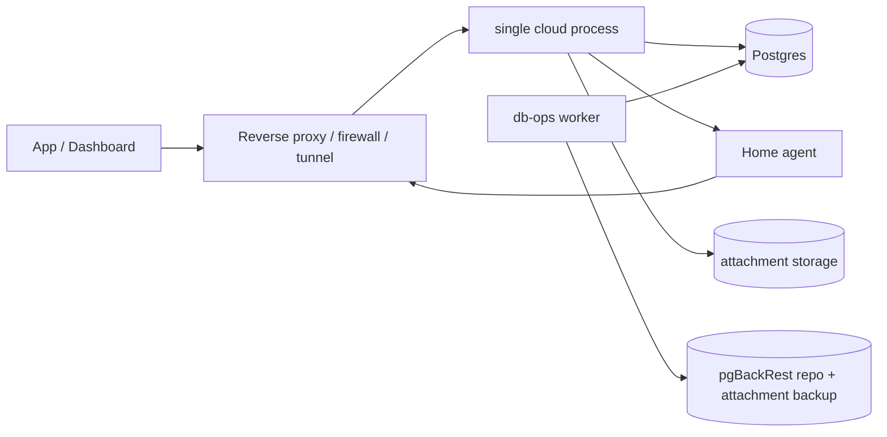

# Hank Backend 100-Readiness Repair Plan

Date: 2026-05-30

Related audit: `docs/backend-architecture-audit.md`

## Objective

Bring Hank Remote backend readiness from the current audit score of 58/100 to 100/100 for the first production target: a single-home deployment that a client runs for their own home and their own invited users.

This is not a statement of work. It is the concrete repair plan: what to build, where to build it, what schema changes are needed, how to migrate safely, what tests prove the repair, and what changes users, operators, and admins will experience.

## Production Target

The first 100-readiness target is not "infinite scale" and is not a multi-tenant SaaS target. It is a safe production baseline for one deployed Hank Remote instance serving one home.

Each client is expected to deploy their own cloud/agent stack for their own home. A deployment may have multiple app users, browser sessions, devices, service profiles, notes, and file shares, but it has exactly one deployment home and one active home-agent path. Multi-home tenancy and multi-cloud-node clustering are outside this 100-readiness plan.

Target capacity:

- 1 deployment home.
- 1 active connected home agent, with clean reconnect handling.
- 50 concurrent app/dashboard WebSocket connections.
- 100 active user sessions.
- 1 million assistant file-index rows.
- 100,000 notes.
- 10 GB note attachments for the first production validation target.
- 10 concurrent file transfers.
- 10 concurrent assistant requests.
- 1 cloud process behind a reverse proxy, firewall, or tunnel.
- 1 Postgres primary with backups and restore-tested recovery.

Target service levels:

- API p95 latency under 250 ms for non-relay, non-assistant, non-file-transfer routes.
- Routed command p95 latency under 1.5 seconds when the agent/local service responds normally.
- File operation status updates every 5 seconds for operations longer than 10 seconds.
- No credential exposure in URLs.
- No production schema changes outside versioned migrations.
- Restore test completed at least weekly and before every release.
- Documented RTO and RPO from real restore tests.

## 100-Readiness Definition

Hank reaches 100/100 when all of these are true:

- The database schema is versioned, constrained, drift-checked, and upgrade-tested.
- The single cloud process can restart without silently losing app tickets, file transfers, rate limits, login backoff, or pending routed request state.
- Single-home behavior is explicit and enforced: one deployment home per instance, with `home_id` used as an internal scope and audit key rather than a multi-home route selector.
- Agent and app connections are tracked by connection ID, not only by session or home.
- Realtime subscriptions are authorized server-side per user and deployment home.
- Destructive file operations are recoverable, audited, progress-tracked, and tested.
- Secrets never appear in URLs, logs, checked-in docs, or world-readable env files.
- Backup, attachment backup, and restore procedures are tested and timed.
- Metrics, audit events, and alerts are enough to investigate incidents.
- Load tests and slow-query telemetry prove the target capacity.
- Admin workflows remain understandable from the dashboard and runbooks.

## Implementation Principles

- Keep the iPhone app on a stable app-facing API.
- Keep local credentials on the home agent.
- Avoid exposing SMB or Home Assistant directly to the internet.
- Prefer Postgres for the first durable coordination repair because the stack already depends on it.
- Use Postgres-backed durable state for restart safety; do not introduce distributed brokers or cloud-node coordination for the single-home production target.
- Treat `/v1/home` as the canonical app-facing home API for this deployment model.
- Preserve the existing `homes` table and `home_id` fields as internal scoping, authorization, and audit boundaries, but do not build user-facing multi-home selection unless the product scope changes.
- Add tests with every behavior repair.
- Add migration and operational proof before deleting compatibility paths.

## Target Architecture



Postgres remains the first durable state backend. The code should expose focused interfaces in packages such as `internal/relay`, `internal/ratelimit`, `internal/audit`, and `internal/migrations` so restart-safe behavior is testable without turning the first production target into a clustered deployment.

## Repair Waves

| Wave | Goal | Readiness after wave |
| --- | --- | ---: |
| 0 | Immediate security and doc hardening | 65 |
| 1 | Versioned migrations and schema integrity | 75 |
| 2 | Durable single-runtime coordination and restart recovery | 86 |
| 3 | Single-home API contract and authorization hardening | 91 |
| 4 | File-operation safety and agent policy | 94 |
| 5 | Observability, audit, alerts, and recovery proof | 97 |
| 6 | Performance/load proof and cleanup of compatibility debt | 100 |

The waves are ordered to avoid unsafe growth. Migrations come before large data-model changes. Durable state comes before restart-sensitive behavior. Single-home API and authorization hardening come before removing old ambiguous helpers.

## Wave 0: Immediate Security and Operator Hardening

### R0.1 Lock down runtime env files

Repair:

- Add a startup check in `cmd/hank-remote-cloud` and `cmd/hank-remote-agent` that warns when configured env file paths are group/world-readable.
- Update setup scripts and docs to run `chmod 600 .env.cloud .env.agent`.
- Add a docs section explaining that `.env.agent` can contain SMB passwords and must be protected.

Files:

- `cmd/hank-remote-cloud/main.go`
- `cmd/hank-remote-agent/main.go`
- `internal/config`
- `docs/deployment.md`
- `docs/runbooks/single-host-compose.md`

Acceptance:

- Unit test for permission detection on Unix.
- Docs show `chmod 600`.
- Running cloud/agent with mode `0644` logs a warning without printing secrets.

### R0.2 Remove credentials from URLs

Repair:

- Deprecate `/ws/agent?agent_id=...&token=...`.
- Require `X-Hank-Agent-ID` and `Authorization: Bearer <token>` for agent WebSocket auth.
- Remove the URL query fallback completely.
- Change file transfer setup to return `transfer_id` and require `Authorization: Bearer <transfer_token>` on `/v1/file-transfers/{id}`.
- Stop returning token-bearing transfer URLs.

Files:

- `internal/cloud/server.go`
- `internal/cloud/file_transfer.go` if split from server
- `internal/agent/client.go`
- `internal/cloud/ui/file-server.js`
- `internal/cloud/ui/hank.js`
- `docs/deployment.md`

Acceptance:

- Tests prove query agent auth fails by default.
- Tests prove header agent auth succeeds.
- Tests prove file transfer with bearer token succeeds.
- Tests prove file transfer with query token fails by default.
- Logs contain transfer IDs but not raw tokens.

### R0.3 Harden storageops file permissions

Repair:

- Change state/log directory creation from `0777` to `0700`.
- Change state/event/output file creation from `0666` to `0600`.
- Explicitly set permissions after atomic rename where needed.
- Run db-ops as a non-root user where possible. If Docker socket access requires group membership, create a dedicated runtime user and group.

Files:

- `internal/storageops/config.go`
- `internal/storageops/status.go`
- `internal/storageops/intents.go`
- `internal/storageops/events.go`
- `internal/storageops/worker.go`
- `Dockerfile.dbops`
- `docker-compose.yml`

Acceptance:

- Unit tests assert file and directory modes.
- db-ops still performs backup/checksum/restore-test.
- No storage event output contains secrets.

### R0.4 Fix metrics docs drift

Repair:

- Update every unauthenticated `/metrics` curl example.
- Add a dashboard/admin-token or reverse-proxy authenticated scrape example.

Files:

- `docs/deployment.md`
- `docs/runbooks/single-host-compose.md`
- `docs/deployment.md`

Acceptance:

- `rg "/metrics"` in docs shows no unauthenticated scrape guidance except explicit negative examples.

## Wave 1: Database Production Safety

### R1.1 Add versioned migrations

Repair:

- Add `internal/migrations` with embedded SQL migrations.
- Add table:

```sql
CREATE TABLE schema_migrations (
  version BIGINT PRIMARY KEY,
  name TEXT NOT NULL,
  checksum TEXT NOT NULL,
  applied_at TIMESTAMPTZ NOT NULL DEFAULT now(),
  duration_ms INTEGER NOT NULL
);
```

- Move the current startup schema into `000001_baseline.up.sql`.
- Add `cmd/hank-remote-cloud migrate up`.
- Add `cmd/hank-remote-cloud migrate status`.
- Add `cmd/hank-remote-cloud migrate baseline` for existing deployments after drift verification.
- Change normal cloud startup to run a read-only drift/status check, not schema mutation.

Files:

- `internal/store/store.go`
- `internal/migrations`
- `cmd/hank-remote-cloud/main.go`
- `Makefile`

Acceptance:

- Empty DB can be created by migrations.
- Existing current DB can be baselined safely.
- Checksum mismatch fails startup.
- CI runs migration-up on a fresh Postgres.
- Migration status is visible in `/readyz` for admins or internal checks.

### R1.2 Add schema drift detection

Repair:

- Add a canonical schema snapshot generated from migrations.
- Add `make schema-drift-check`.
- Check tables, columns, constraints, indexes, extensions, and migration checksums.

Files:

- `internal/migrations`
- `scripts/schema-drift-check.sh` or Go equivalent
- `Makefile`

Acceptance:

- Manual DB changes are detected.
- Missing index or constraint fails the drift check.
- Drift check is documented in release procedure.

### R1.3 Add database constraints for business rules

Repair:

Add `CHECK` constraints for:

- `home_memberships.role IN ('admin', 'member')`
- `home_invitations.role IN ('admin', 'member')`
- `agents.status IN ('online', 'offline')`
- `home_service_profiles.service_type IN ('homeassistant', 'smb')`
- `home_permissions.feature IN ('homeassistant', 'files', 'notes')`
- `home_member_permissions.feature IN ('homeassistant', 'files', 'notes')`
- `user_notes.page_type IN ('text', 'board')`
- `note_shares.permission IN ('read', 'write')`
- `note_operations.operation_type IN ('save', 'rename', 'delete', 'collab')`
- `note_attachments.status IN ('pending', 'ready', 'deleted')` if status column exists or is added.
- Assistant run/tool states based on domain constants.
- OpenAI provider/auth provider values based on domain constants.

Files:

- New migrations
- `internal/domain`
- Store tests

Acceptance:

- Insert/update invalid enum values fails.
- Domain constants and constraints stay synchronized through tests.

### R1.4 Complete foreign keys and delete semantics

Repair:

- Add FK from `note_operations.session_id` to `app_sessions(id)` with `ON DELETE SET NULL` if session IDs are historical metadata.
- Add FK from `home_note_sync_state.agent_id` to `agents(id)` with `ON DELETE SET NULL`.
- Review every existing FK and explicitly choose `RESTRICT`, `CASCADE`, or `SET NULL`.
- Add tests for user/home/member/agent deletion behavior.

Acceptance:

- Every FK has documented delete behavior.
- Deleting a user or home cannot create hidden orphan rows.
- Audit and history rows retain enough metadata after session/user cleanup.

### R1.5 Fix assistant file-index uniqueness

Repair:

- Add cleanup migration to detect duplicate `(home_id, service_profile_id, path)` conflicts.
- Replace `UNIQUE(home_id, path)` with `UNIQUE(home_id, service_profile_id, path)`.
- Update upsert queries in `internal/store/assistant_index.go`.
- Add source-profile filters to search where relevant.

Acceptance:

- Two service profiles can index the same path without collision.
- Existing duplicate rows are migrated deterministically.
- Tests cover same path across two SMB sources.

### R1.6 Normalize note storage

Repair:

- Make `user_notes.body_markdown` the canonical body column.
- Keep `content` as compatibility shadow for one release, written from canonical content.
- Stop reading from `home_notes` except in one-time migration.
- Add migration to backfill `body_markdown`.
- Add migration or archive table for legacy `home_notes`.
- Add a follow-up deletion migration after compatibility expires.

Acceptance:

- New notes write one canonical body.
- Old notes still load.
- Sync tests prove no data loss across upgrade.

### R1.7 Add lifecycle cleanup jobs

Repair:

- Add `internal/maintenance` package with scheduled jobs.
- Jobs:
  - prune expired app sessions
  - prune expired/revoked agent tokens after retention period
  - prune expired invitations
  - prune expired OAuth states
  - purge soft-deleted note attachments after retention
  - prune old assistant traces/audit details by policy
  - delete stale file-transfer leases
  - delete stale connection and relay request records

Acceptance:

- Each cleanup job is idempotent.
- Jobs emit metrics and audit summaries.
- Retention values are configurable.

## Wave 2: Durable Coordination and Restart Recovery

### R2.1 Add single-runtime health tracking

Repair:

Add table:

```sql
CREATE TABLE cloud_runtime (
  deployment_id TEXT PRIMARY KEY CHECK (deployment_id = 'singleton'),
  runtime_id TEXT NOT NULL,
  version TEXT NOT NULL,
  started_at TIMESTAMPTZ NOT NULL,
  heartbeat_at TIMESTAMPTZ NOT NULL,
  shutdown_at TIMESTAMPTZ NULL
);
```

Each cloud process generates a runtime ID on startup and heartbeats the singleton row every 10 seconds. This is not a cluster registry; it exists to make readiness, cleanup, and restart diagnostics explicit.

Acceptance:

- `/readyz` reports runtime ID, deployment mode, and DB coordination health.
- Restart replaces the singleton runtime row without requiring manual cleanup.
- Stale connection and relay rows from older runtime IDs are pruned or marked failed by lifecycle cleanup.

### R2.2 Track connections by connection ID

Repair:

Add tables:

```sql
CREATE TABLE agent_connections (
  connection_id TEXT PRIMARY KEY,
  runtime_id TEXT NOT NULL,
  home_id TEXT NOT NULL REFERENCES homes(id) ON DELETE CASCADE,
  agent_id TEXT NOT NULL REFERENCES agents(id),
  capabilities_json TEXT NOT NULL DEFAULT '[]',
  connected_at TIMESTAMPTZ NOT NULL,
  heartbeat_at TIMESTAMPTZ NOT NULL,
  disconnected_at TIMESTAMPTZ NULL
);

CREATE TABLE app_connections (
  connection_id TEXT PRIMARY KEY,
  runtime_id TEXT NOT NULL,
  session_id TEXT NOT NULL REFERENCES app_sessions(id) ON DELETE CASCADE,
  user_id TEXT NOT NULL REFERENCES users(id),
  connected_at TIMESTAMPTZ NOT NULL,
  heartbeat_at TIMESTAMPTZ NOT NULL,
  disconnected_at TIMESTAMPTZ NULL
);
```

In memory, keep only live socket pointers. In Postgres, keep connection metadata for observability, cleanup, and restart-safe failure handling.

Acceptance:

- Multiple app connections can share one session.
- Disconnecting one tab does not remove another tab.
- Agent reconnect replaces only the intended connection.
- Stale connection rows are pruned.

### R2.3 Persist pending routed requests

Repair:

Add table:

```sql
CREATE TABLE relay_requests (
  request_id TEXT PRIMARY KEY,
  home_id TEXT NOT NULL REFERENCES homes(id),
  app_connection_id TEXT NOT NULL,
  agent_connection_id TEXT NULL,
  command TEXT NOT NULL,
  request_payload JSONB NOT NULL,
  response_payload JSONB NULL,
  status TEXT NOT NULL CHECK (status IN ('pending', 'sent', 'completed', 'failed', 'timed_out', 'cancelled')),
  error_code TEXT NOT NULL DEFAULT '',
  error_message TEXT NOT NULL DEFAULT '',
  created_at TIMESTAMPTZ NOT NULL,
  sent_at TIMESTAMPTZ NULL,
  completed_at TIMESTAMPTZ NULL,
  expires_at TIMESTAMPTZ NOT NULL
);
```

Add `internal/relay`:

- `CreateRequest`
- `MarkSentToAgent`
- `CompleteRequest`
- `FailRequest`
- `ExpireRequests`
- `ListActiveForConnection`

Use in-process wakeups for the live single cloud process. Use Postgres as the source of truth for timeout handling, restart cleanup, duplicate request detection, and admin/debug visibility.

Acceptance:

- App command handling writes a durable relay row before sending work to the agent.
- Agent responses complete the durable relay row and wake the waiting app connection when it is still live.
- Cloud restart marks or expires pending requests predictably instead of losing them silently.
- Per-connection and per-home in-flight caps are enforced from durable state.

### R2.4 Persist app tickets

Repair:

Add table:

```sql
CREATE TABLE app_ws_tickets (
  token_hash TEXT PRIMARY KEY,
  session_id TEXT NOT NULL REFERENCES app_sessions(id) ON DELETE CASCADE,
  user_id TEXT NOT NULL REFERENCES users(id),
  created_at TIMESTAMPTZ NOT NULL,
  expires_at TIMESTAMPTZ NOT NULL,
  consumed_at TIMESTAMPTZ NULL
);
```

Consume tickets atomically with `UPDATE ... WHERE consumed_at IS NULL AND expires_at > now()`.

Acceptance:

- Ticket issued before a cloud restart can be consumed after restart if it is still valid.
- Ticket cannot be reused.
- Expired tickets are pruned.

### R2.5 Persist file transfer leases

Repair:

Add table:

```sql
CREATE TABLE file_transfers (
  id TEXT PRIMARY KEY,
  token_hash TEXT NOT NULL UNIQUE,
  home_id TEXT NOT NULL REFERENCES homes(id),
  user_id TEXT NOT NULL REFERENCES users(id),
  operation TEXT NOT NULL CHECK (operation IN ('download', 'upload')),
  source_id TEXT NOT NULL DEFAULT '',
  path TEXT NOT NULL,
  status TEXT NOT NULL CHECK (status IN ('pending', 'active', 'completed', 'failed', 'expired')),
  bytes_total BIGINT NULL,
  bytes_done BIGINT NOT NULL DEFAULT 0,
  created_at TIMESTAMPTZ NOT NULL,
  expires_at TIMESTAMPTZ NOT NULL,
  completed_at TIMESTAMPTZ NULL
);
```

Acceptance:

- Transfer setup survives cloud restart until expiry.
- Expired transfers cannot be used.
- Transfer progress is queryable.
- Transfer token never appears in returned URL.

### R2.6 Durable rate limits and login backoff

Repair:

Add tables:

```sql
CREATE TABLE rate_limit_events (
  bucket TEXT NOT NULL,
  key_hash TEXT NOT NULL,
  occurred_at TIMESTAMPTZ NOT NULL
);

CREATE INDEX idx_rate_limit_events_bucket_key_time
  ON rate_limit_events(bucket, key_hash, occurred_at DESC);

CREATE TABLE login_backoff (
  email_hash TEXT PRIMARY KEY,
  failures INTEGER NOT NULL,
  blocked_until TIMESTAMPTZ NULL,
  updated_at TIMESTAMPTZ NOT NULL
);
```

Hash IP/email identifiers with a server-side pepper before storing.

Acceptance:

- Rate limits hold across cloud restarts.
- High-cardinality attack cannot grow unbounded because cleanup runs and keys are hashed.
- Login backoff survives cloud restarts.

## Wave 3: Single-Home API Contract and Authorization

### R3.1 Codify the singleton deployment-home contract

Repair:

- Keep `/v1/home` and `/v1/home/...` as the canonical app and dashboard routes.
- Do not add `/v1/homes` or `/v1/homes/{home_id}` as part of this readiness plan.
- Ensure first setup creates the one deployment home and later users join that same home by invitation or admin-controlled membership.
- Resolve the deployment home server-side after authentication; app clients should not choose a home ID.
- Keep `home_id` in tables, protocol messages, metrics, and audit events as an internal scope key.
- Add an admin repair path or runbook for accidental extra home rows instead of turning that state into supported multi-home behavior.

Acceptance:

- A normal user cannot create or select a second home in the same deployment.
- Non-members cannot access the deployment home by guessing IDs or calling home routes directly.
- Existing app/dashboard flows continue to use `/v1/home`.
- Startup or readiness reports a clear operator error if the database contains more than one active home.

### R3.2 Replace brittle singleton helpers with a deployment-home resolver

Repair:

- Replace scattered singleton helper calls with a small `DeploymentHomeResolver`.
- Allow zero homes only during first setup.
- After setup, enforce exactly one active deployment home as a readiness invariant.
- Make membership and feature permission checks take the resolved deployment home ID explicitly.
- Make agent routing use the resolved deployment home ID, not client-provided home selection.

Acceptance:

- Zero-home first boot works until the first admin registration creates the deployment home.
- More than one active home produces a clear readiness/admin error, not undefined routing behavior.
- One user can belong to the deployment home with one role.
- Agent routing is tied to the deployment home ID.

### R3.3 Server-scope realtime topics

Repair:

- Replace raw client topic subscription with server-authorized subscription descriptors.
- Validate every requested topic against authenticated user and home membership.
- For profile topics, scope to the current user.
- For note collaboration topics, verify owner/share/member access before subscription.
- Include home/user scope in internal topic keys.

Acceptance:

- User A cannot subscribe to User B profile events.
- Member without notes permission cannot subscribe to home note events.
- Users only receive home-scoped events for the singleton deployment home they are a member of.

### R3.4 Strengthen role and feature permission model

Repair:

- Add permission checks at service boundaries, not only route handlers.
- Define `Authorizer` interface used by HTTP and WebSocket command paths.
- Add audit events for permission denied and administrative permission changes.
- Add tests for user-to-user, non-member, revoked-member, and feature-disabled access attempts.

Acceptance:

- Every app command path has an explicit authorization test.
- Agent requests cannot be invoked without matching deployment-home permission.
- Admin-only actions are centrally listed and tested.

## Wave 4: File Safety and Agent Policy

### R4.1 Replace unsafe cross-source move with managed jobs

Repair:

Add table:

```sql
CREATE TABLE file_operation_jobs (
  id TEXT PRIMARY KEY,
  home_id TEXT NOT NULL REFERENCES homes(id),
  user_id TEXT NOT NULL REFERENCES users(id),
  operation TEXT NOT NULL CHECK (operation IN ('move', 'copy', 'delete', 'upload', 'download')),
  source_id TEXT NOT NULL,
  destination_source_id TEXT NOT NULL DEFAULT '',
  from_path TEXT NOT NULL,
  to_path TEXT NOT NULL DEFAULT '',
  is_directory BOOLEAN NOT NULL DEFAULT false,
  status TEXT NOT NULL CHECK (status IN ('queued', 'running', 'completed', 'failed', 'cancelled', 'rollback_required', 'rolled_back')),
  bytes_total BIGINT NOT NULL DEFAULT 0,
  bytes_done BIGINT NOT NULL DEFAULT 0,
  files_total BIGINT NOT NULL DEFAULT 0,
  files_done BIGINT NOT NULL DEFAULT 0,
  error_message TEXT NOT NULL DEFAULT '',
  created_at TIMESTAMPTZ NOT NULL,
  updated_at TIMESTAMPTZ NOT NULL,
  completed_at TIMESTAMPTZ NULL
);
```

Agent behavior:

- Same-source move uses atomic rename where available.
- Cross-source move becomes copy job plus verification plus source delete.
- Verify copied file size and checksum before deleting source.
- For directories, track each file and continue/retry safely.
- If verification fails, leave source untouched and mark job failed.
- Support cancel before delete phase.
- Emit progress events.

Acceptance:

- Cross-source move never deletes source unless destination verifies.
- Partial copy failure leaves source intact.
- Directory move can resume or be retried idempotently.
- UI shows progress and failure reason.

### R4.2 Add per-source access policy

Repair:

Extend service profiles with policy:

```json
{
  "read": true,
  "write": true,
  "delete": false,
  "allowed_prefixes": ["/Media", "/Documents"],
  "blocked_prefixes": ["/Private"],
  "max_upload_bytes": 1073741824
}
```

Enforce policy in cloud before routing and in agent before execution.

Acceptance:

- Cloud denies unauthorized source/path/action before routing.
- Agent independently denies unauthorized source/path/action.
- Admin UI exposes source policy settings.

### R4.3 Add destructive action confirmation and audit

Repair:

- Require confirmation token for large deletes, directory deletes, and cross-source moves.
- Emit audit events for move/copy/delete/upload/download start and completion.
- Include actor, home, source, normalized path hash, operation, result, and request ID.

Acceptance:

- Accidental large destructive action needs explicit confirmation.
- Audit trail can answer who deleted/moved what and when without exposing raw secrets.

## Wave 5: Observability, Audit, Recovery

### R5.1 Durable audit events

Repair:

Add table:

```sql
CREATE TABLE audit_events (
  id TEXT PRIMARY KEY,
  occurred_at TIMESTAMPTZ NOT NULL,
  actor_user_id TEXT NULL REFERENCES users(id) ON DELETE SET NULL,
  actor_agent_id TEXT NULL REFERENCES agents(id) ON DELETE SET NULL,
  home_id TEXT NULL REFERENCES homes(id) ON DELETE SET NULL,
  event_type TEXT NOT NULL,
  severity TEXT NOT NULL CHECK (severity IN ('info', 'warning', 'critical')),
  request_id TEXT NOT NULL DEFAULT '',
  ip_hash TEXT NOT NULL DEFAULT '',
  target_type TEXT NOT NULL DEFAULT '',
  target_id TEXT NOT NULL DEFAULT '',
  metadata_json JSONB NOT NULL DEFAULT '{}'
);
```

Audit event types:

- login failed/succeeded
- session created/revoked
- agent token created/revoked
- permission changed
- invitation created/accepted/deleted
- service profile changed
- storage backup/restore requested/completed/failed
- file operation requested/completed/failed
- assistant external provider failure
- rate limit exceeded

Acceptance:

- Admin dashboard can filter audit events.
- Audit events do not contain raw tokens or secrets.
- Security incidents can be reconstructed after restart.

### R5.2 Metrics upgrade

Repair:

- Add Prometheus-compatible histograms for HTTP latency and relay latency.
- Add Go runtime metrics.
- Add DB pool metrics.
- Add backup freshness gauge.
- Add restore-test age gauge.
- Add attachment storage bytes gauge.
- Add file job status gauges.
- Add assistant provider request/error counters.
- Keep `/metrics` admin-only or expose a separate internal listener bound to `127.0.0.1`.

Acceptance:

- Metrics include runtime/deployment labels where useful for restart diagnostics and local dashboards.
- Alerting rules can be written for all production risks.
- Existing dashboard still works.

### R5.3 Alert rules

Repair:

Add deployable alert definitions for:

- login failure spike
- agent auth failure spike
- agent offline too long
- routed request timeout spike
- DB ping failure
- stale backup
- stale restore test
- disk usage high
- file job failure spike
- assistant provider error spike
- cloud runtime heartbeat missing

Files:

- `ops/prometheus/alerts.yml` or `docs/monitoring/alerts.yml`
- `docs/runbooks/*.md`

Acceptance:

- Every alert has a runbook link.
- Alerts can be evaluated by `promtool` if Prometheus rules are used.

### R5.4 Backup and restore proof

Repair:

- Add an automated restore-test command that:
  - restores Postgres to `postgres-restore`
  - runs schema drift check
  - runs app integrity checks
  - verifies sample users/homes/notes/agents/assistant indexes
  - verifies attachment metadata against attachment files
  - records RTO/RPO
- Add attachment backup:
  - tar/restic/rclone backup of attachment root
  - manifest table or manifest file with checksums
  - restore procedure tied to DB timestamp
- Add env/config backup checklist with secret-handling rules.

Acceptance:

- Restore test report is generated automatically.
- Dashboard shows latest backup and restore-test status.
- Production release checklist requires a recent restore test.

## Wave 6: Performance, Load Proof, and Compatibility Cleanup

### R6.1 Add query telemetry

Repair:

- Enable `pg_stat_statements` in the Postgres image/config.
- Add admin-only endpoint or dashboard section for top query summaries.
- Add slow-query log settings for production.

Acceptance:

- Top 20 slow queries can be produced from real telemetry.
- Slow-query report is included in release readiness.

### R6.2 Add search indexes and query rewrites

Repair:

- Add FTS indexes for assistant documents and file index.
- Add HNSW or IVFFLAT pgvector indexes where pgvector is available.
- Add pagination/delta to note and file index listing paths.
- Replace broad Go-side scoring with indexed SQL ranking where practical.
- Cache `AssistantIndexStats` or maintain summary counters.

Acceptance:

- Assistant search remains within target p95 on 1 million file-index rows.
- Query plans use expected indexes.
- Load tests include realistic notes and file index data.

### R6.3 Load tests

Repair:

Add `tests/load` or `tools/loadtest` with scenarios:

- login/session validation
- app WebSocket connect/reconnect
- agent WebSocket connect/reconnect
- app to agent relay through the single cloud process
- file transfer setup and streaming
- cross-source file move job progress
- assistant context search
- notes list/sync
- backup during normal traffic

Acceptance:

- Load tests run against the single-home target deployment shape.
- Report includes p50/p95/p99, error rate, DB CPU/memory, and cloud memory.
- No target service level fails.

### R6.4 Remove compatibility debt

Repair:

- Remove query-parameter agent auth after compatibility window.
- Remove transfer query tokens.
- Remove ambiguous or bypass-prone singleton helper paths after `DeploymentHomeResolver` is in place.
- Remove legacy `home_notes` reads.
- Remove any UI/API affordance that suggests multiple homes are supported in one deployment.
- Retire phase docs that conflict with current runbooks.

Acceptance:

- Deprecated paths return clear errors or redirects.
- App/dashboard uses the canonical single-home routes.
- Docs and tests do not reference removed behavior.

## Complete Issue-to-Repair Map

| Audit issue | Repair |
| --- | --- |
| H1 no versioned migrations | R1.1, R1.2 |
| H2 in-memory router/tickets/transfers/rate limits | R2.1 through R2.6 |
| H3 ambiguous singleton-home helpers/startup validation | R3.1, R3.2, R6.4 |
| H4 db-ops Docker socket/root privilege | R0.3, R5.4 |
| H5 weak DB constraints/FKs | R1.3, R1.4 |
| H6 unsafe cross-source file move | R4.1, R4.3 |
| H7 restore unverified | R5.4 |
| M1 agent query auth fallback | R0.2, R6.4 |
| M2 file transfer tokens in URLs | R0.2, R2.5 |
| M3 env files mode 0644 | R0.1 |
| M4 realtime topic scoping | R3.3 |
| M5 app connection keyed by session | R2.2 |
| M6 vector dimension mismatch | R1.1 plus migration policy: schema dimension must match configured dimension or config becomes fixed at 768 |
| M7 no slow-query telemetry | R6.1 |
| M8 metrics gaps | R5.2, R5.3 |
| M9 storageops permissive modes | R0.3 |
| M10 metrics docs drift | R0.4 |
| M11 derived index retention unclear | R1.7, R6.2 |
| L1 HTTP timeouts incomplete | Add `ReadTimeout`, `WriteTimeout`, `IdleTimeout`; exempt or tune streaming transfer paths |
| L2 placeholder rebinding fragile | Replace manual rebinding with pgx-native `$n` queries or a SQL-aware binder |
| L3 dashboard/API same binary | Keep for now; add internal metrics listener and package boundaries before optional split |
| L4 old phase docs | R6.4 docs cleanup |

## Vector Dimension Repair Decision

Choose one of these before Wave 1 ships:

Preferred repair:

- Make production embedding dimension fixed at 768.
- Remove or hide `HANK_REMOTE_AI_EMBEDDING_DIMENSION` from normal setup.
- Keep non-768 dimensions only for tests and local fallback paths that do not write pgvector columns.

Alternative repair:

- Store pgvector dimension in a migration-created setting.
- Refuse startup if configured dimension differs from the DB vector dimension.
- Provide a rebuild migration path that drops/recreates vector columns and re-indexes embeddings.

Acceptance:

- Production cannot silently write wrong-dimension embeddings.
- Tests cover dimension mismatch startup failure.

## HTTP Timeout Repair

Repair:

- Add `ReadTimeout`, `WriteTimeout`, and `IdleTimeout` to the HTTP server.
- For long file transfers, use route-level streaming behavior and context cancellation instead of globally unlimited writes.
- Add max duration and byte limits to transfer operations.

Acceptance:

- Slowloris-style tests fail safely.
- Legitimate large file transfer still works.
- Server shutdown cancels transfer contexts predictably.

## SQL Placeholder Repair

Repair:

- Convert store queries to native Postgres `$1`, `$2` placeholders.
- Remove `rebindPlaceholders`, or keep it only for tests with a SQL-aware parser.
- Add a regression test containing a literal `?` in SQL text.

Acceptance:

- Query behavior no longer depends on blind string rewriting.
- Store tests pass on Postgres-backed test DB.

## Release and Rollout Plan

### Branching

- Create one branch per wave.
- Keep migrations backwards-compatible within each wave.
- Land tests before enabling new production behavior by default.

### Deployment Order

1. Deploy Wave 0 hardening.
2. Backup database and attachment volume.
3. Deploy migration runner in status-only mode.
4. Baseline existing DB.
5. Deploy Wave 1 migrations.
6. Deploy Wave 2 durable coordination and restart-recovery tables.
7. Restart the single cloud process and verify app tickets, transfer leases, rate limits, and relay failures behave predictably.
8. Deploy the singleton deployment-home resolver and authorization hardening.
9. Update dashboard/app copy that implies multi-home selection.
10. Enable production alerts.
11. Run restore test.
12. Run load test against the single-home target.
13. Remove deprecated paths.

### Rollback Rules

- No migration ships without a forward-fix plan.
- Destructive migrations are delayed by at least one release after data is no longer read.
- Compatibility aliases remain until app/dashboard usage telemetry shows no active dependency.
- If durable relay fails, fall back to the previous in-process relay while preserving persisted data for inspection and forward repair.

## Required Test Matrix

| Area | Tests |
| --- | --- |
| Migrations | fresh DB, existing baseline, checksum mismatch, drift detection |
| Auth | cookie, bearer, CSRF, header-only agent auth, expired sessions |
| Authorization | user-to-user, non-member, revoked member, role changes, feature permissions |
| Relay | app to agent, cloud restart, timeout, duplicate request ID |
| Realtime | profile isolation, home isolation, note-share isolation |
| File ops | traversal, symlink escape, cross-source copy failure, checksum mismatch, retry, cancel |
| Backups | backup success, restore-test success, restore-test failure, attachment manifest mismatch |
| Observability | metrics render, audit event redaction, alert rule syntax |
| Performance | query plans, p95/p99 load test, DB pool saturation |

## Quick Impact Report

### User Experience

Positive changes:

- Fewer lost requests during cloud restarts.
- Multiple browser tabs/devices work reliably.
- File moves become safer and show progress instead of appearing stuck.
- Search and assistant context retrieval become faster at larger data sizes.
- Single-home behavior becomes explicit and predictable.
- Permissions become clearer because access is checked per deployment home and feature.

User-visible changes:

- Users stay in the one home for this deployment; admins invite or remove users from that home.
- Large destructive file actions may require confirmation.
- File transfer links may no longer be directly copyable without auth; downloads/uploads stay inside authenticated flows.
- Some old agent setup URLs will stop working after the compatibility window.

### Setup Experience

Positive changes:

- Setup becomes safer because env file permissions are checked.
- Agent setup uses headers/tokens instead of URL query credentials.
- Migrations provide a clear upgrade step instead of implicit startup schema mutation.
- Readiness checks become more meaningful.

New setup requirements:

- Operators must run or allow `migrate up` before starting a new release.
- Operators must protect `.env.cloud` and `.env.agent` with `chmod 600`.
- Operators must configure attachment backup in addition to database backup.
- Deployments still need a reverse proxy, firewall rule, or tunnel that preserves WebSocket support for the single cloud process.

### Maintenance

Positive changes:

- Schema drift becomes detectable.
- Cleanup jobs reduce stale sessions, tokens, tickets, transfers, and derived data.
- Slow-query telemetry identifies real performance issues.
- Versioned migrations reduce upgrade guesswork.
- Restore tests turn backup health from assumption into evidence.

Maintenance cost:

- More tables and jobs to monitor.
- More release discipline around migrations.
- More operational checks before production rollout.
- More tests, especially integration tests that need Postgres.

### Admin Use

Positive changes:

- Admins can see audit events for sensitive actions.
- Admins can see backup and restore-test status.
- Admins can manage source-level file permissions.
- Admins can investigate failed logins, offline agents, route timeouts, and file jobs.
- Admins can rotate/revoke tokens with clearer evidence of usage.

Admin-visible changes:

- Storage/restore actions may require stronger confirmation.
- Metrics access remains authenticated or internal-only.
- Admin dashboards should show migration status, runtime health, backup freshness, restore-test age, and recent critical audit events.

## Final Gate Checklist

Hank reaches 100 readiness only when this checklist is green:

- `make fmt`
- `make tidy`
- `go test ./...`
- `go build ./...`
- migration fresh install test
- migration baseline test
- schema drift check
- single-runtime relay restart test
- singleton-home authorization test suite
- file job safety test suite
- restore test report generated
- attachment restore verified
- alert rules validated
- load test report meets target
- top 20 query report generated from telemetry
- deprecated URL-token paths disabled
- docs updated for setup, admin, runbooks, and recovery

Demo-server validation inputs, commands, and generated report locations are tracked separately in `docs/demo-validation.md` so production code stays free of demo hostnames, live tokens, LAN addresses, and generated `data/` artifacts.
